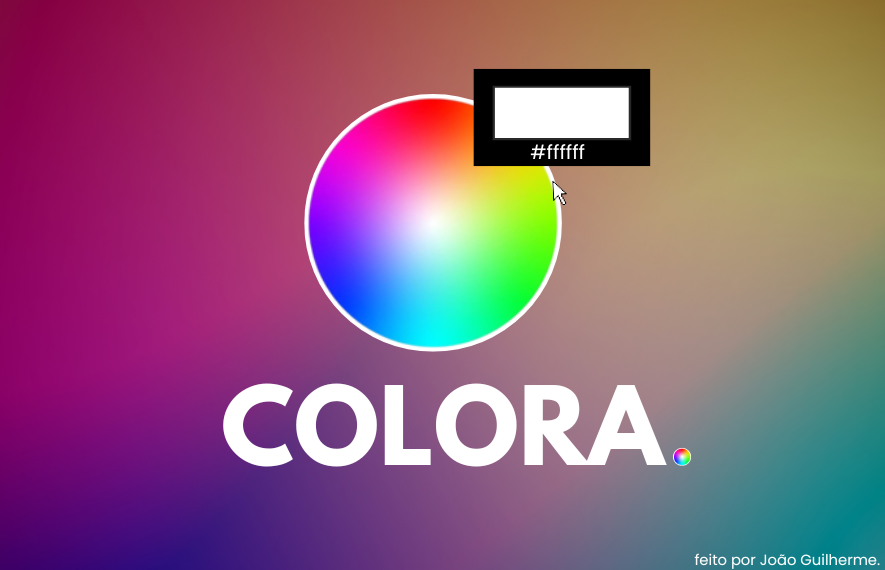

# 🎨 Colora

Colora é uma ferramenta simples e eficiente para capturar, identificar e copiar cores da sua tela com precisão. Ideal para desenvolvedores, designers ou qualquer pessoa que trabalhe com cores digitalmente.

---

## 🧩 Funcionalidades

- Captura a cor de qualquer ponto da tela.
- Copia a cor no formato **HEX** direto para sua área de transferência.
- Interface amigável e extremamente leve.
- Ícone customizado e instalador seguro.

## 🧪 Como usar

Abra o Colora e, em seguida, pressione o atalho Windows + Shift + C para ativar a ferramenta.
Use o botão esquerdo do mouse para capturar e copiar a cor (formato #HEX) diretamente para a área de transferência, ou pressione Esc para cancelar.
O Colora permanece em execução discretamente na bandeja do sistema (system tray), na barra de tarefas.
